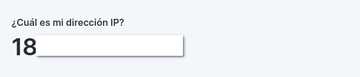

# Descubre DuckDNS: Gestiona y Publica Servicios sin Costos

## Inspiración

Esta investigación comenzó cuando me di cuenta de que, al iniciar mis proyectos, no quería pagar por servicios de dominio. Además, soy bastante malo para elegir nombres, lo que sentía que me retrasaría considerablemente. Intenté encontrar dominios gratuitos, pero la mayoría están limitados a períodos de prueba o vienen con muchas restricciones. Fue entonces cuando descubrí DuckDNS, una plataforma que, aunque no te hace dueño del dominio, te permite crear varios DNS y redirigirlos a tus servicios con gran facilidad.

## Objetivo

El objetivo de esta página es mostrarte las diversas maneras en que puedes aprovechar DuckDNS. Te enseñaré cómo automatizar la actualización de tu IP (si usas IP dinámica), mencionaré herramientas que te ayudarán a redirigir tus DNS a tus servicios, cómo eliminar DNS que ya no necesites, y cómo publicar tus servicios en internet utilizando el DNS.

## Requisitos

- Cuenta en DuckDNS
- ISP que permita exponer puertos
- Docker
- Servidor

## Recursos

- [¿Qué es un DDNS?](https://www.accessq.com.mx/que-es-dns-dinamico/)
- [Duck DNS](https://www.duckdns.org/faqs.jsp)
- [Duck DNS con docker](https://hub.docker.com/r/linuxserver/duckdns)
- [¿Cómo saber mi IP publica?](https://nordvpn.com/es-mx/what-is-my-ip/)

## Tutorial

### Averiguar nuestra IP publica

1. Necesitamos averiguar si nuestra IP publica es estática y dinámica (la mayoría de las veces es dinámica), para eso entramos a la pagina [https://nordvpn.com/es-mx/what-is-my-ip/](https://nordvpn.com/es-mx/what-is-my-ip/?srsltid=AfmBOorMziUumvR2DFgBSbZMKvGHho3fhLUheFuc8IDQSbMEnN7FiWYe) y verificamos cual es nuestra IP 
    
    
    
    Después de averiguar cual es nuestra dirección IP publica, tenemos varias formas de comprobar si es estática o dinámica, pero la mas efectiva y fácil es desconectar el router de tu ISP y volver a conectarlo, después de que se reinicie el router debemos volver a checar en la pagina, si la IP es diferente quiere decir que nuestra IP es dinámica, por lo contrario si se mantiene la misma IP quiere decir que es estática (sin embargo te sugiero consultarlo con tu ISP, debido a que las IPs estaticas se suelen contratar aparte o si pertenece a una compañia.)
    

### Configurar DuckDNS

1. Entramos a nuestra cuenta de DuckDNS y debemos de tener varios parametros en cuenta:
    1. Correo
    2. Token
    3. Dominios Y su información
    
    Debe de lucir algo asi:
    
    
    
2. Creamos un dominio nuevo, tienes que entender que a pesar de que diga “dominio” lo que se realmente esta pasando es que se esta creando un subdominio en el dominio “duckdns.org” por lo que el nombre que elijas va a tener el dominio de duck dns, ejemplo: [pablito.duckdns.org](http://pablito.duckdns.org) (no existe el link). 
3. Vamos a configurar el docker-compose.yml y cambiamos los siguientes apartados por nuestros datos.
    
    ```yaml
    	    - TZ=Etc/UTC #optional
          - SUBDOMAINS=subdomain1,subdomain2
          - TOKEN=token
    ```
    
    Esto va a permitir que aunque nuestra dirección IP cambien, nuestro servicio DuckDNS va a detectar la nueva IP y va a redireccionar el trafico hacia la nueva  IP, lo que va ayudar a que no pierdas conectividad con tus servicios.
    
4. Una vez creado nuestros subdominios, te va a parecer su información, podemos ver que nombre tiene, la direccion IP publica a la que esta asociada, la dirección IPv6 (si existe el caso), la ultima actualización de la IP y la opción de eliminar el subdominio. Una de las mas grandes desventajas de DuckDNS es que solo te permite crear 5 subdominios, sin embargo, puedes decidir eliminar los subdominios cuando quieras y volver a recuperar la posibilidad de crear otro. 
    
    
    

### Proxy inverso

Un proxy inverso lo que permite es asociar el DNS de DuckDNS a la dirección IP de nuestros servicios, es decir que si tu servidor tiene la direccion 192.168.1.125 y estas utilizando el servicio SSH en el puerto 22, puedes asocial el nombre [pablito.duckdns.org](http://pablito.duckdns.org) al servicio de SSH y conectarte con ese nombre en lugar de poner la direccion IP

1. Revisa todos mis trabajos y busca uno relacionado a **“Nginx Proxy manager”** y sigue todos los pasos de la documentación
2. Tambien lo puedes hacer manualmente con **Nginx** y configurar los archivos host para cada servicio y subdominio 

### Exposición de puertos

En este apartado podría ser muy extenso si se explica detalladamente varia ligeramente las configuraciones dependiendo de nuestro router y ISP, asi que se va a dar recomendaciones y explicaciones generales.

1. Se recomienda activar la zona desmilitarizada y se pone la direccion IP local de nuestro servidor 
    
    
    
2. Y si activas la zona desmilitarizada no es necesario configurar el port forwarding (depende del router), en mi caso solo habría que hacer la activación de los puertos, en este caso es necesario activar los puertos que estén utilizando tus servicios. Se recomienda no exponer servicios delicados como base datos, directorios y paginas web sin estar seguros que no tiene vulnerabilidades. Ademas de que si dejas de utilizar un puerto se debe de desactivar por cuestiones de seguridad.
    
    
    

### Verificación de servicios

Para verificar que todo este funcionando correctamente tenemos que ir descartando por partes:

1. Debemos checar que nuestro servicio funcione a nivel local, es decir que por ejemplo si estas utilizando SSH y la direccion del servidor es 192.168.1.125 debes poder conectarte usando `ssh usuario@192.168.1.125`. Si funciona, quiere decir que todo a nivel local esta bien, si hay algún error es probable que el servicio SSH este mal configurado
2. Debemos checar que funciona a través de nuestra dirección IP publica, en este caso, si nuestra direccion IP publica es 187.125.12.159, debemos poder conectarnos usando `ssh usuario@187.125.12.159` . Si todo funciona bien quiere decir que hicimos correctamente la exposición de servicios. Si no funciona quiere decir que la configuración de nuestro router es incorrecta, recomiendo hacer un diagrama de red, checar reglas de firewall (tanto internas como externas), verificar que nuestro ISP permita abrir puertos y entre otras posibilidades.
3. Despues de verificar que todo lo anterior funciona,  es momento de verificar que nuestro servicio de DuckDNS este funcionando correctamente. Para eso intentamos conectarnos con el comando `ssh usuario@pablito.duckdns.org` . Si funciona correctamente, quiere decir que hemos logrado con éxito todo el tutorial, si lamentable en este punto falla, puedes checar que el subdominio este apuntando a la dirección IP correcta, que la configuración del proxy inverso sea la correcta, que no haya conflicto de puertos, firewalls y si estas tratando de utilizar el puerto 443 tienes que verificar que tengas el certificado SSL (que en mi pagina tengo tutorial de como configurar y generar certificados SSL gratis) y que el puerto se mantenga abierto a pesar desde de abrirlo en el router, lo ideal seria que primero lo intentes sin usar el https.
